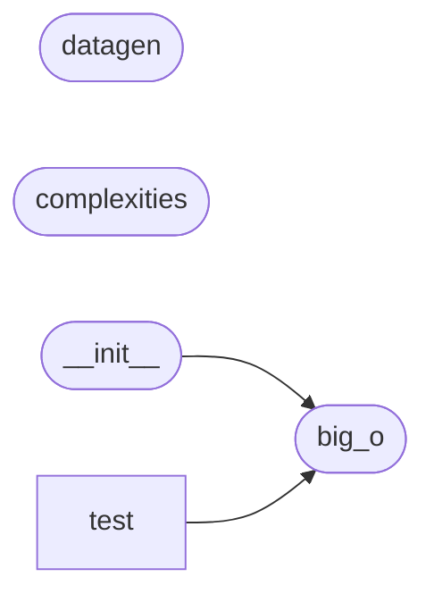

# Code Overview

[_Documentation generated by Documatic_](https://www.documatic.com)

<!---Documatic-section-Codebase Structure Python-start--->
## Codebase Structure Python

The codebase has a single-depth folder structure,
                with 9 code files in total.

<!---Documatic-block-system_architecture-start--->

<!---Documatic-block-system_architecture-end--->

# #
<!---Documatic-section-Codebase Structure Python-end--->

<!---Documatic-section-Important Functions-start--->
## Important Functions

<!---Documatic-block-important_funcs-start--->
<!---Documatic-block-most_used_funcs-start--->
### Most Utilised Functions

* big_o.big_o.complexities (3 times)
* big_o.big_o.datagen (3 times)
<!---Documatic-block-most_used_funcs-end--->
<!---Documatic-block-important_funcs-end--->

# #
<!---Documatic-section-Important Functions-end--->

<!---Documatic-section-Class Hierarchy-start--->
## Class Hierarchy

<!---Documatic-block-big_o.complexities.ComplexityClass-start--->

	
<code>big_o.complexities.ComplexityClass</code> (Click to Expand!)

* big_o.complexities.Constant
* big_o.complexities.Cubic
* big_o.complexities.Exponential
* big_o.complexities.Linear
* big_o.complexities.Linearithmic
* big_o.complexities.Logarithmic
* big_o.complexities.Polynomial
* big_o.complexities.Quadratic
* big_o.test.test_complexityclass_comparisons.AltFirstComplexityClass
* big_o.test.test_complexityclass_comparisons.FirstComplexityClass

<!---Documatic-block-big_o.complexities.ComplexityClass-end--->

<!---Documatic-block-object-start--->

	
<code>object</code> (Click to Expand!)

* big_o.complexities.ComplexityClass

<!---Documatic-block-object-end--->

# #
<!---Documatic-section-Class Hierarchy-end--->

[_Documentation generated by Documatic_](https://www.documatic.com)